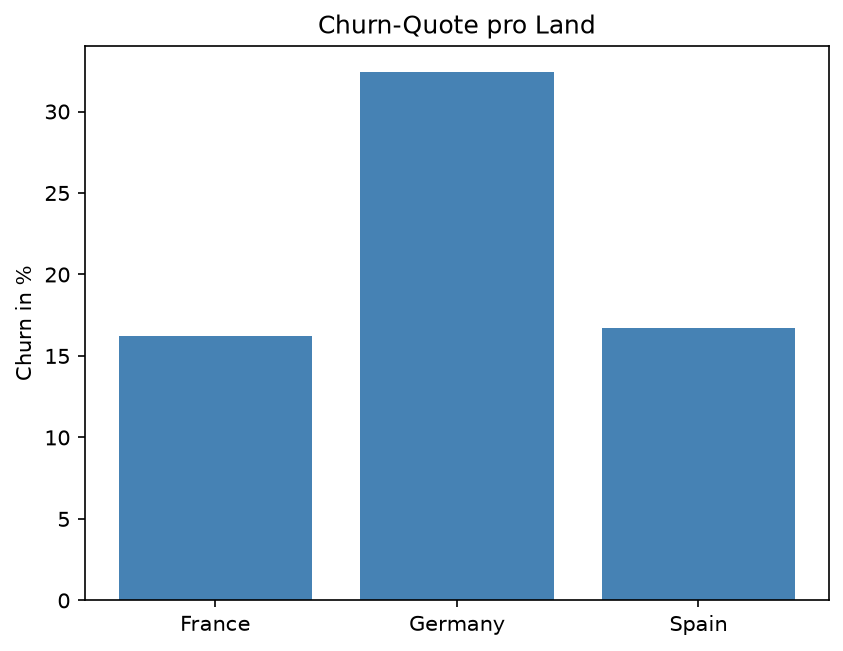
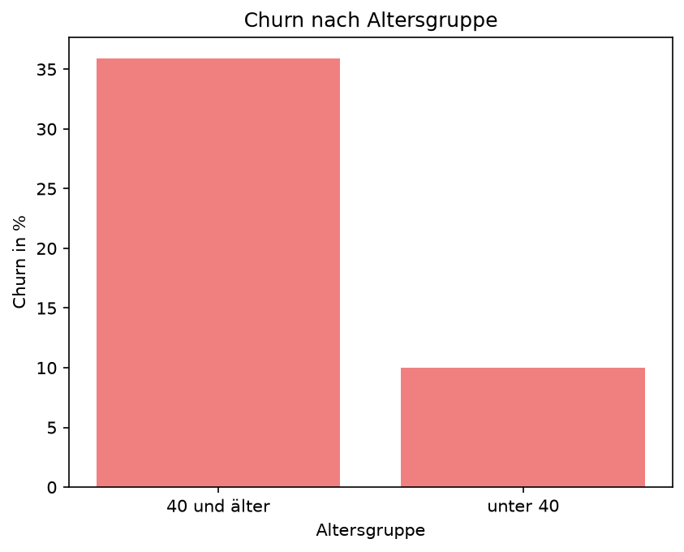
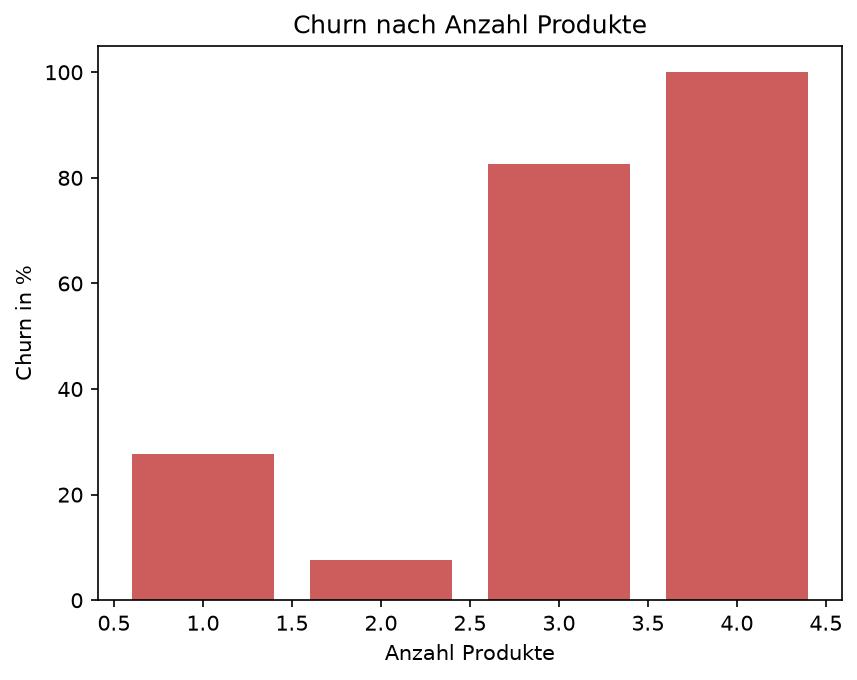

# Bank Customer Churn — Analyse mit SQL & Python

Analyse der Kundenabwanderung ("Churn") bei einer Retail-Bank auf Basis von 10.000 Kundendatensätzen.
Ziel: die Segmente identifizieren, in denen Kunden am häufigsten kündigen, und daraus eine konkrete Handlungsempfehlung ableiten.

**Kernergebnis:** Ein klar abgegrenztes Hochrisiko-Segment (deutsche, inaktive Kunden über 40) kündigt mit **62,2 %** und damit mehr als das Dreifache des Gesamtdurchschnitts von ~20 %.

---

## Datensatz

- **Quelle:** [Churn Modelling (Kaggle)](https://www.kaggle.com/datasets/shrutimechlearn/churn-modelling)
- **Umfang:** 10.000 Kunden, 14 Merkmale
- **Zielvariable:** `Exited` (1 = Kunde hat gekündigt, 0 = geblieben)
- **Wichtige Merkmale:** Land (`Geography`), Alter (`Age`), Anzahl Bankprodukte (`NumOfProducts`), Kontostand (`Balance`), Aktivitätsstatus (`IsActiveMember`), Geschlecht (`Gender`)

## Vorgehen & Tools

| Schritt | Werkzeug |
|---|---|
| Rohdaten (CSV) in Datenbank geladen | SQLite (DB Browser for SQLite) |
| Datenanalyse & Business-Fragen | SQL |
| Auswertung & Visualisierung | Python · pandas · matplotlib |

Der Ablauf: CSV → SQLite-Tabelle → 8 analytische Fragen per SQL beantwortet → Ergebnisse in Python geladen und als Diagramme visualisiert.

---

## Findings

### 1. Gesamt-Churn
Von 10.000 Kunden haben **2.037 gekündigt → 20,4 %**. Das ist die Basislinie, gegen die alle Segmente verglichen werden.

### 2. Abwanderung nach Land



| Land | Kunden | Gekündigt | Churn-Quote |
|---|---|---|---|
| Frankreich | 5.014 | 810 | 16,2 % |
| **Deutschland** | 2.509 | 814 | **32,4 %** |
| Spanien | 2.477 | 413 | 16,7 % |

**Deutschland ist das Problem: doppelt so hohe Churn-Quote wie Frankreich und Spanien.** Auffällig: Deutschland hat fast dieselbe absolute Kündigerzahl wie Frankreich (814 vs. 810), aber aus nur der halben Kundenbasis. Ohne die Betrachtung der Quote (statt der absoluten Zahl) wäre dieser Effekt unsichtbar geblieben.

### 3. Abwanderung nach Alter



| Altersgruppe | Kunden | Gekündigt | Churn-Quote |
|---|---|---|---|
| unter 40 | 5.987 | 597 | 10,0 % |
| **40 und älter** | 4.013 | 1.440 | **35,9 %** |

Ältere Kunden kündigen **3,6-mal häufiger** als jüngere. Auch hier hätten die absoluten Zahlen (1.440 vs. 597) den Unterschied unterschätzt — erst die Quote macht das Ausmaß sichtbar.

### 4. Abwanderung nach Anzahl Bankprodukte



| Produkte | Kunden | Gekündigt | Churn-Quote |
|---|---|---|---|
| 1 | 5.084 | 1.409 | 27,7 % |
| 2 | 4.590 | 348 | **7,6 %** (treuste Gruppe) |
| 3 | 266 | 220 | 82,7 % |
| 4 | 60 | 60 | 100,0 % |

**Der Zusammenhang ist nicht linear.** Zwei Produkte sind der Sweet Spot mit der niedrigsten Churn-Quote. Kunden mit 3–4 Produkten wandern jedoch fast vollständig ab. Das deutet auf ein Produkt- oder Beratungsproblem hin (mögliche Ursachen: Overselling, ungeeignete Produktbündel).
 Hinweis: Die Gruppen mit 3 und 4 Produkten sind klein (266 bzw. 60 Kunden). Die Quoten sind ein starkes Signal, statistisch aber weniger belastbar als die großen Gruppen, hier wäre eine vertieftee Untersuchung nötig.

### 5. Weitere Treiber
- **Geschlecht:** Frauen 25,1 % vs. Männer 16,5 %:Frauen kündigen ~1,5-mal häufiger.
- **Kontostand:** Höheres Guthaben geht mit *höherem* Churn einher (kein Guthaben 13,8 % → bis 100k 20,6 % → über 100k 25,2 %). Dieser Effekt überschneidet sich vermutlich mit dem Deutschland-Effekt (dort typischerweise hohe Kontostände) und müsste getrennt betrachtet werden.

### 6. Hochrisiko-Segment (Kombination der Treiber)
Werden die stärksten Risikofaktoren kombiniert — **deutsche Kunden, über 40, inaktiv** — ergibt sich:

| Segment | Kunden | Gekündigt | Churn-Quote |
|---|---|---|---|
| Deutschland · 40+ · inaktiv | 596 | 371 | **62,2 %** |

Fast zwei von drei Kunden dieses Segments kündigen — das Dreifache des Durchschnitts, bei einer belastbaren Gruppengröße von 596 Kunden.

---

## Handlungsempfehlung

1. **Retention-Maßnahmen auf das Hochrisiko-Segment fokussieren.** Die 596 deutschen, inaktiven Kunden über 40 bieten den größten Hebel: Wer hier ansetzt, adressiert die höchste Churn-Konzentration statt Ressourcen breit zu streuen.
2. **Produkt-3/4-Kunden untersuchen, bevor das Problem skaliert.** Churn-Quoten von 80–100 % sind ein Alarmsignal — eine Ursachenanalyse (Vertriebsprozess, Gebühren, Beratung) sollte Priorität haben.
3. **Reaktivierungs-Kampagnen für inaktive Mitglieder**, da Inaktivität ein zentraler Bestandteil des Hochrisiko-Segments ist.
4. **Deutschland-Markt tiefer analysieren**, um die Ursache der doppelt so hohen Abwanderung zu verstehen.

---

## Methodische Grundsätze dieser Analyse
- **Quoten statt absoluter Zahlen:** Da die Vergleichsgruppen unterschiedlich groß sind, werden Churn-*Raten* verglichen, nicht absolute Kündigerzahlen. Absolute Zahlen führen sonst zu Fehlschlüssen (siehe Deutschland- und Alters-Findings).
- **Gruppengrößen berücksichtigt:** Kleine Segmente (z. B. 4 Produkte, n=60) werden als Signal, nicht als gesicherte Aussage behandelt.
- **Sich überschneidende Effekte benannt** (z. B. Kontostand × Land), statt vorschnell zu kausalen Schlüssen zu springen.

## Projekt ausführen

```bash
# Umgebung anlegen und Pakete installieren
python -m venv churn_env
churn_env\Scripts\python.exe -m pip install pandas matplotlib

# Analyse-Skript ausführen (erzeugt die PNG-Grafiken)
churn_env\Scripts\python.exe churn.py
```

Voraussetzung: `churn.db` (aus `Churn_Modelling.csv` in SQLite importiert) im angegebenen Pfad.

## Dateien im Projekt
- `churn.py` — Analyse- und Visualisierungsskript (SQL-Abfragen + matplotlib-Grafiken)
- `churn_pro_land.png`, `churn_pro_alter.png`, `churn_pro_produkt.png` — erzeugte Diagramme
- `README.md` — dieses Dokument

## Ausblick
- **JOIN-Erweiterung:** Referenztabelle Land → Region ergänzen, um Multi-Table-Joins zu demonstrieren.
- **GenAI-Schicht:** Findings automatisiert per LLM-API in eine Executive Summary zusammenfassen.
- **ML-Modell:** Churn-Vorhersage (scikit-learn) auf Basis der identifizierten Treiber.

---

*Analyseprojekt zum Aufbau praktischer SQL- und Python-Kenntnisse im Data-Analytics-Bereich.*
